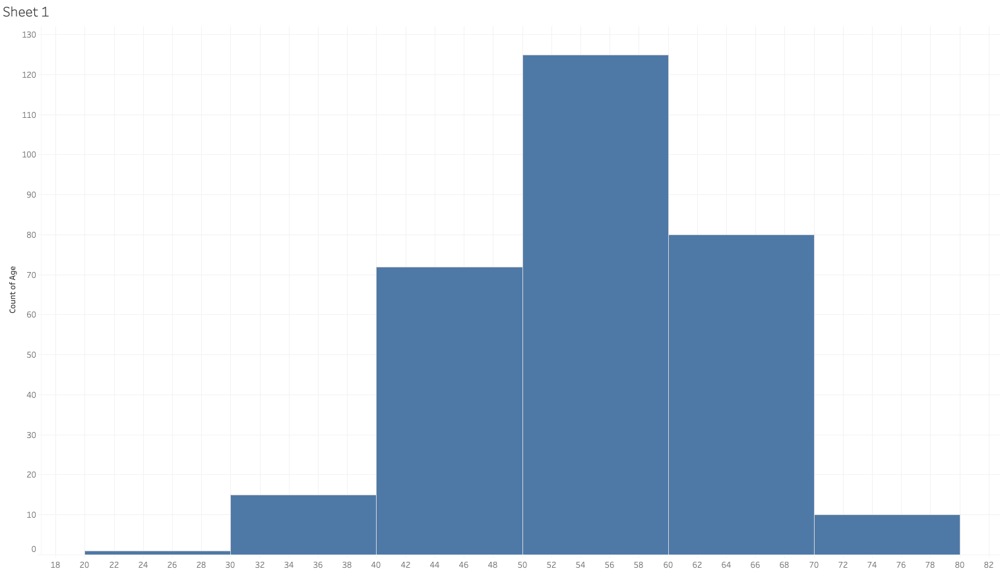
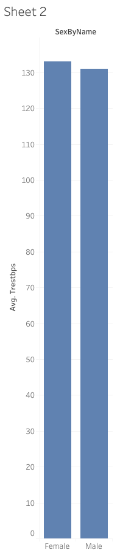
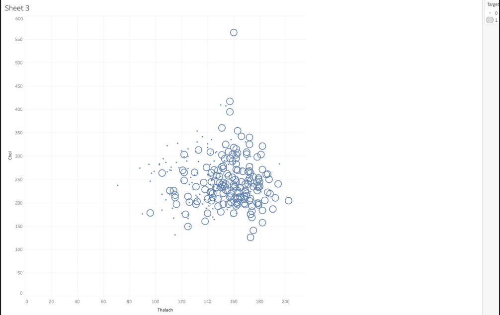

Build a Tableau dashboard using the UCI Heart Disease dataset.

## DataSet:

Download the [linked dataset](https://www.kaggle.com/cherngs/heart-disease-cleveland-uci)

The dataset contains 14 columns with the following attributes:

* Age
* Sex (0: Female, 1: Male)
* Chest pain type (4 values)
* Resting blood pressure
* Serum cholesterol in mg/dl
* Fasting blood sugar > 120 mg/dl
* Resting electrocardiographic results (values 0,1,2)
* Maximum heart rate achieved
* Exercise-induced angina
* Oldpeak = ST depression induced by exercise relative to rest
* The slope of the peak exercise ST segment
* Number of major vessels (0-3) colored by flourosopy
* Thal: 3 = normal; 6 = fixed defect; 7 = reversable defect
* Target

Load the data into Tableau (remember that csv files are referred to as "Text file" in Tableau)

### Sheet 1:

Create a histogram of the patients' ages in the dataset as shown below. Use bins of size 10. Hint: google "Tableau histogram"

.

### Sheet 2:

Create a bar chart that displays the average resting blood pressure (Trestbps) by gender as shown below. Note: you will need to create a Calculated field to display the sex by name.

.

### Sheet 3:

Create a scatter plot that displays the serum cholesterol in mg/dl (Chol) as a function of the maximum heart rate achieved (Thalach) as show below. Make the size of the circle proportional to the "Target" value.

## Dashboard:

* Format the charts to your liking.
* Put the three sheets in a dashboard.
* If you have time feel free to create more charts to add to the dashboard.