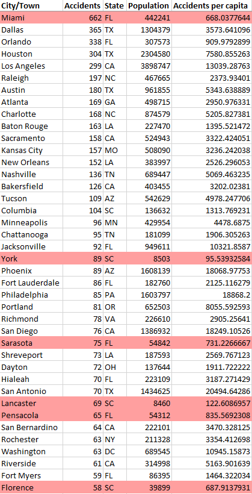
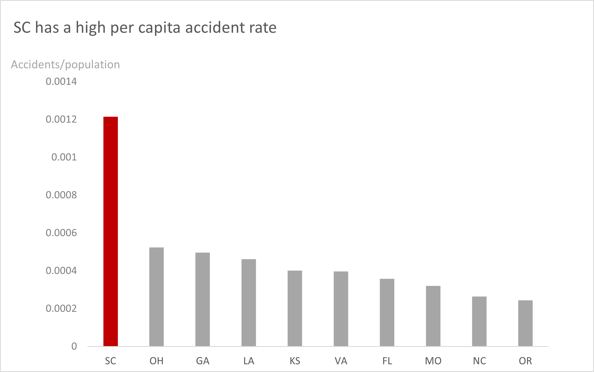

# Traffic Accidents: The where and the why.
### Kapilan Mahalingam, Business Project MVP, August 2022
I'm only using the first week of 2021 (the full dataset has ~3 million observations; the restricted one has ~18000). A quick sample:

This is the cities with over 20 accidents in the week of January 1st, 2021, sorted from most to least accidents, with population and per capita figures. *Note that the 'Accidents per capita' is the inverse of the true accidents per capita, to avoid floating point issues.*

Larger cities like Dallas, Houston, LA are unsurprisingly high. Highlighted entries are those which fell into the highest 10% of accidents per capita, which merit a closer look.

This gives us states which had the highest accidents per capita, and SC seems to stand out particularly. Even in the above table, 50% of highlighted cities are in SC, with York and Lancaster particularly standing out as accident hotspots.
